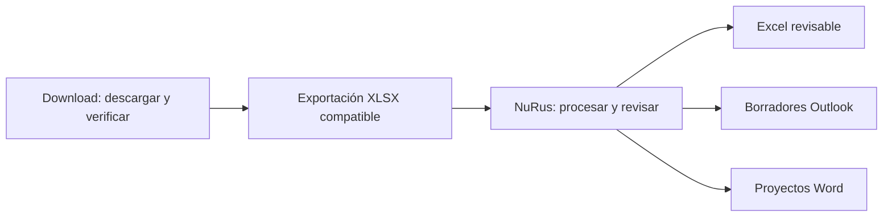

# Download y NuRus: comparación e integración con CSMP

**Actualización:** el exportador productivo y los cambios de NuRus están ahora
en ramas experimentales separadas. Estado y uso:
[GUIA_EXPERIMENTAL.md](GUIA_EXPERIMENTAL.md). Este documento conserva la comparación
original; `pruebas/integracion_exportador_csmp.py` verifica el nuevo recorrido.

Fecha: 1 de octubre de 2026.

- Download revisado: `3b989d5`, versión 2.2.0 y rama de revisión.
- NuRus revisado: [`7d155e3`](https://github.com/MatiGaete2023/NuRus/tree/7d155e3f24083f97c2f3768d6ba98e3a2a323ca2),
  producto vigente **CSMP Assistant personal 0.4.0.dev11**.

La integración por archivos locales es viable y se comprobó con datos ficticios.
La recomendación es **exportar desde Download un libro XLSX preparado para CSMP y
procesarlo en NuRus**, aprovechando su motor, revisión, correos y resoluciones.
No hace falta una API remota ni fusionar las aplicaciones para empezar.
El exportador de uso diario y su botón todavía no están implementados: la sonda
de esta revisión demuestra compatibilidad técnica de tablas controladas.

## Qué aporta cada herramienta

| Aspecto | Download | NuRus / CSMP Assistant | Decisión recomendada |
|---|---|---|---|
| Entrada | Sesión habitual de Chrome, formularios y descargas SITFA. | Excel local: Espera, Cumplimiento e Informes. | Download adquiere y verifica; NuRus analiza. |
| Garantía principal | Cada Excel coincide con su página HTML y su escritura queda verificada. | Lectura con procedencia, reglas de observación y revisión humana preservada. | Mantener ambos controles, distinguiendo integridad de descarga y aptitud para análisis. |
| Formatos | BIFF, OOXML, XML Spreadsheet 2003 y HTML tabular, incluso bajo `.xls`. | Selección de `xlrd` para `.xls` y `openpyxl` para `.xlsx/.xlsm`. | Convertir el contenido reconocido a XLSX real. Cambiar la extensión sin convertir no resuelve HTML/XML. |
| Pantallas | Seguimiento, Litigantes y dos calendarios mensuales. | Tres modos de análisis; no tiene modo Litigantes ni calendario de medidas. | Admitir inicialmente Seguimiento. Incorporar calendario de informes solo si sus columnas cumplen el contrato. |
| Resultados | XLS originales, PDF de consultas vacías y JSON de verificación. | Excel revisable, observaciones, borradores Outlook, proyectos Word y estadísticas. | Conservar originales en Download y producir un derivado para CSMP. |
| Alcance | Tribunales y opciones disponibles en la cuenta SITFA. | Reglas dependientes de tribunal reconocen Laja, Mulchén y Tomé; matrices Word solo Laja y Mulchén. | Mostrar cobertura por función. Un tribunal descargable no implica matriz ni reglas específicas disponibles. |
| Modalidades | IDs SITFA 1/2/3/4: Residencia/Ambulatorio/FAE/DCE. | Claves RES/AMB/FAE/DCE, además de clasificación por programa; FAS se reconoce como FAE. | Mapeo explícito y conservación del nombre del programa original. |
| Entorno | Python >=3.10, Tkinter, Chrome; sin Office para adquirir. | Python 3.12–3.14, CustomTkinter; Excel/Outlook Windows para el flujo institucional. | Mantener entornos separados; exportar XLSX no añade Office a Download. |
| Acciones externas | Consultas y descargas de lectura. | Guarda borradores; no envía correos ni escribe en RUS/SATURNO. | La integración mantiene el flujo de revisión y registro humano. |

## Hallazgos comprobados

### 1. No todo archivo `.xls` de Download se puede abrir directamente en NuRus

`motor.read_excel` reconoce el formato por el contenido. En cambio,
`nurus.rus.reader._engine` y `personal.importing.read_external` eligen el lector
por la extensión. Se comprobaron nueve combinaciones: tres modos por HTML,
XML Spreadsheet 2003 y OOXML guardados como `.xls`. Download leyó las nueve;
el análisis directo de NuRus rechazó las nueve; al convertir sus tablas a XLSX,
NuRus procesó las nueve. Esto no significa que todos los XLS fallen: un XLS-BIFF
auténtico es el formato esperado por `xlrd`.

**Mejora:** un adaptador de salida en Download permite mantener NuRus sin cambios
inicialmente y reunir páginas verificadas en una tabla de trabajo por modo.
Como mejora futura de NuRus, detectar BIFF/OOXML por firma daría mensajes más
precisos; el tratamiento de HTML/XML requiere una conversión explícita probada,
no enviar cualquier contenido a pandas como si fuera un libro convencional.

### 2. Verificación de descarga y columnas para las reglas son controles distintos

Download compara RIT/nombre, multiplicidad y archivos. NuRus necesita además
programa, tribunal y datos específicos para aplicar sus reglas. La sonda encontró
que una hoja única con solo RIT/NOMBRE puede entrar en `Work.analyze`, con
advertencias, sin las columnas funcionales necesarias y sin acciones generadas.
Aceptar un archivo no acredita que el análisis sea completo.

**Mejora:** antes de exportar para CSMP, mostrar «Compatible», «Compatible con
limitaciones» o «Sin datos suficientes para este modo», especificando las
columnas que faltan. No inventar fechas ni completar días con cero. Distinguir
columnas ausentes de celdas vacías en filas concretas. Los originales se
conservan aunque una tabla no sea apta para CSMP.

### 3. «Cargar externa» y «PROCESAR» tienen propósitos diferentes

`Work.external` importa observaciones y reglas ya guardadas; no ejecuta el motor.
La sonda cargó una tabla nueva de Espera por esa ruta y no se generaron reglas ni
acciones. `Work.analyze`, usado por PROCESAR, sí las genera.

**Mejora de experiencia:** la guía o futura acción «Abrir en CSMP» debe indicar
modo/hoja y dirigir al flujo de análisis. No indicar al usuario que cargue una
descarga nueva como revisión externa ni rellenar `NURUS_REGLAS` desde Download.

### 4. Un cruce completo puede mejorar Cumplimiento

`Work.analyze` busca informes futuros mediante una identidad de cinco campos:
RIT, RUT, nombre, tribunal y programa. Con una hoja CUMPLIMIENTO y otra INFORMES,
identidad completa y fecha futura, la sonda comprobó `CUMPLIMIENTO.C10_HOJA2`.
Sin cruce, NuRus advierte y continúa sin evaluar C-10.

**Mejora:** entregar un libro con ambas tablas cuando los lotes seleccionados
sean compatibles. Mantener una única tabla de informes de cruce para evitar
elecciones ambiguas. No sustituir RUT faltante por nombre ni cruzar solo por RIT.
Normalizar etiquetas equivalentes de tribunal/programa mediante correspondencias
verificadas: el emparejamiento actual elimina paréntesis y ajusta espacios y
mayúsculas, pero no garantiza equivalencia entre todas las abreviaturas.
Fechas distintas de informes con la misma identidad requieren aviso; el perfil
actual usa la última fila futura, por lo que el orden de consolidación debe ser
estable y no cambiar silenciosamente la decisión. No sustituirlo por «mínima»
o «máxima» sin revisar las reglas del Asistente.

### 5. No conviene duplicar las funciones de NuRus en Download

NuRus ya tiene filtros/búsqueda, contexto persistente, revisiones, selección de
modalidades, edición de borradores, prevención de duplicados y agrupación de
proyectos por tribunal/RIT/tipo. Añadir esos motores a Download crearía dos
implementaciones que podrían divergir. Sí conviene trasladar patrones sencillos
de uso: búsqueda de tribunales, alcance visible y acceso al archivo/carpeta.

## Contrato propuesto para «Exportar para CSMP»

El usuario elige un lote válido o lotes compatibles y pulsa **Exportar para
CSMP**. Recibe `Para CSMP.xlsx` y un resumen de compatibilidad. Luego abre el
Asistente, selecciona Espera, Cumplimiento o Informes, el libro y PROCESAR.
La automatización de ese último paso puede esperar: hoy no existe un argumento
de inicio documentado para precargar archivo/modo/hoja.



| Hoja / dato | Campos para comprobar antes de ofrecer el análisis | Tratamiento |
|---|---|---|
| ESPERA | Identidad, TRIBUNAL, programa/DERIVACIÓN/NOMBRE CENTRO y T ESPERA o alias aceptado. | Todas las páginas de estructura compatible; conservar filas repetidas. |
| CUMPLIMIENTO | Identidad, TRIBUNAL, programa, DÍAS DE CUMPLIMIENTO y DÍAS PARA EGRESAR. Fechas de ingreso/egreso y fichas según regla. | Mostrar qué reglas no podrán evaluarse por fechas/columnas ausentes. |
| INFORMES | Identidad, TRIBUNAL, programa y FECHA VENCIMIENTO. | No confundir FECHA INGRESO con INGRESO EFECTIVO ni vencimiento de informe con fin de medida. |
| Cruce de C-10 | RIT, RUT, NOMBRE, TRIBUNAL, programa y vencimiento futuro. | Todos los campos de la clave disponibles y etiquetas coherentes entre tablas. |
| Procedencia | Lote, consulta, pantalla, tribunal ID/etiqueta, modalidad ID/clave, archivo, página, fila original y hash. | Columnas `SITFA_*` y hoja de trazabilidad, con relación al manifiesto de Download. |
| Consulta vacía | Consulta, cero registros y referencia a su PDF. | Resumen de evidencia; no convertir el PDF en una fila ni intentar extraer personas. |
| Revisión humana | OBSERVACION, FECHA_OBS, TT, CC, RES y columnas técnicas NuRus. | La descarga nueva no lleva gestiones realizadas ni valores inventados. NuRus crea sus columnas y conserva revisiones en su copia de trabajo. |

Para identidad, la exportación debe conservar los identificadores presentes;
no anunciar a priori que RUT siempre existe. El contrato de entrada admite
distintos encabezados de identidad, pero algunas reglas y cruces requieren
campos adicionales. También se preservan todas las columnas originales.

### Reglas del adaptador

1. Usar los manifiestos de Download para seleccionar archivos, comprobar hash y
   estado completo. Ampliarlos con selección estructurada: no deducir tribunal,
   modalidad o período por el nombre de archivo.
2. Convertir por contenido con `motor.read_excel`; extraer todas las columnas y
   filas con un contrato probado por formato. Los nueve casos de la sonda tienen
   tablas limpias: la extracción productiva debe probar portadas, cabeceras
   repetidas, pies, varias páginas y límites de tamaño.
3. Agrupar por modo y estructura compatible. Usar nombres ESPERA, CUMPLIMIENTO,
   INFORMES cuando hay una tabla inequívoca por modo; si se separan esquemas,
   indicar hoja a elegir. No crear varias hojas compatibles sin explicar cuál
   usar. Mantener Resumen/Trazabilidad sin encabezados que parezcan otra tabla.
4. Si falta TRIBUNAL en un Excel, se puede añadir desde su consulta validada,
   dejando registrado ese origen; si ya existe, comprobar coherencia. No llenar
   nombre, RUT, programa, fechas ni días faltantes usando suposiciones.
5. Añadir MODALIDAD con etiquetas compatibles RES/AMB/FAE/DCE y conservar el ID
   SITFA. Validar que la selección corresponda a la tabla. Los calendarios pueden
   contener varias modalidades: no atribuirles una única por defecto.
6. Escribir texto como texto, neutralizar fórmulas no solicitadas, preservar
   ceros de identificadores y crear un archivo nuevo. No deduplicar por persona
   o causa ni reutilizar IDs de revisión de NuRus para filas nuevas.
7. Registrar fecha de descarga y fecha de exportación por separado. NuRus analiza
   con la fecha del día por defecto: un libro antiguo y sus días de espera o
   cumplimiento requieren aviso, no recalcularlos sin la semántica verificada.
8. Procesar/revisar en NuRus; conservar sus IDs, ajustes y constancias en el
   resultado revisable. Una nueva descarga no sobrescribe ese libro ni hereda
   automáticamente una revisión previa por RIT/nombre.

## Mejoras concretas para ambas herramientas

| Prioridad / esfuerzo | Lugar | Cambio propuesto | Problema resuelto |
|---|---|---|---|
| Alta / medio | Download | Exportador XLSX para CSMP con comprobación de columnas y procedencia. | Conversiones y uniones manuales; incompatibilidad de XLS disfrazados. |
| Alta / bajo | Download | Resumen que distinga «Descarga verificada» de «Apto para CSMP» y señale tablas/columnas pendientes. | Confundir integridad del archivo con suficiencia de datos para reglas. |
| Alta / medio | Download | Seleccionar Cumplimiento e Informes compatibles para crear el libro de cruce. | C-10 omitida por falta de una hoja relacionada; preparación manual del cruce. |
| Media / bajo | NuRus, siguiente fase | Comprobación visible de campos por modo antes de analizar y mensaje específico sobre formato real. | Procesamiento limitado de hojas incompletas y errores poco claros al abrir HTML como XLS. |
| Media / medio | NuRus, siguiente fase | Leer procedencia `SITFA_*` y mostrar acceso al original de una fila. | Perder el vínculo entre revisión, planilla convertida y descarga verificada. |
| Media / medio | NuRus, siguiente fase | Precarga opcional de archivo/modo/hoja por argumentos de inicio y aviso de antigüedad del lote. | Volver a localizar y seleccionar el libro; usar una descarga vieja sin advertirlo. |
| Media / bajo | Download | Búsqueda, alcance persistente, doble clic para abrir archivo y contexto de lote. | Fricciones que NuRus ya aborda con patrones simples de interfaz. |
| Media / medio | Ambas | Fixtures compartidos de exportación/importación con versión de contrato. | Una nueva cabecera o conversión rompe la integración sin detectarse en pruebas aisladas. |

NuRus declara dev11 congelada para uso cotidiano controlado. Esta revisión
evalúa una ampliación solicitada y no modifica su código. El primer exportador
puede vivir completamente en Download; las mejoras de NuRus se plantean para
una fase posterior, conservando sus reglas y flujo operativo.

## Qué integrar primero y cómo verificarlo

1. **Exportación por modo**, comenzando con Seguimiento. Comprobar hash de fuentes,
   recuentos, todas las columnas, multiplicidad, texto/fechas y origen por fila.
   NuRus debe leer el libro, generar las mismas reglas que una tabla equivalente
   de prueba y preservar una copia revisable. No hace falta cambiar su interfaz.
2. **Cruce Cumplimiento/Informes**, después de comprobar identidad, alcance y
   fechas. Probar RUT ausente, abreviaturas diferentes, informes duplicados con
   fechas distintas, hojas ambiguas y datos sin resultados. La ausencia de cruce
   sigue siendo un aviso, no un bloqueo del resto del trabajo.
3. **Entrega con menos pasos**, añadiendo precarga en NuRus solo cuando la
   compatibilidad esté probada. No lanzar PROCESAR ni guardar productos sin que
   el usuario entre en su flujo habitual.
4. **Historial y comparación**, conservando la distinción entre filas descargadas,
   observaciones propuestas, revisiones humanas, borradores y gestiones reales.

Litigantes y calendario de medidas pueden continuar como exportaciones de
análisis/evidencia de Download. No convertirlos a Espera/Cumplimiento por parecido
de nombres. Para informes de calendario, demostrar primero las columnas y la
semántica de fechas necesarias con muestras representativas; que se identifique
RIT/NOMBRE MENOR no basta.

## Evidencia y límites de esta revisión

- Sonda reproducible en [`pruebas/compatibilidad_csmp.py`](pruebas/compatibilidad_csmp.py):
  nueve conversiones, insuficiencia de columnas, cruce C-10 y diferencia entre
  análisis e importación externa. Crea/elimina sus libros ficticios temporales.
- **77 pruebas de NuRus aprobadas** en Python 3.12/Linux: flujo personal,
  selección de hojas, lector/reglas, contrato de rendimiento y revisión de lotes.
  Es una selección dirigida, no toda su suite ni una nueva certificación Windows.
- No se consultó SITFA, no se reutilizó una sesión, no se ejecutó Excel/Outlook,
  no se guardaron borradores ni se generaron documentos judiciales en esta sonda.
- Falta validar tablas completas de descargas representativas y el recorrido de
  usuario con Excel/Outlook Windows. La sonda no implementa consolidación de lotes,
  comprobación de hashes del lote ni el exportador productivo.

Reproducción, usando entornos de prueba separados:

```powershell
# En el repositorio NuRus: entorno opcional de desarrollo, no el de uso diario.
py -3.12 -m venv .venv
.venv\Scripts\python.exe -m pip install -e ".[dev,excel-legacy]"
# Ejecutar la sonda de Download con ese Python y la ruta a NuRus.
.venv\Scripts\python.exe ..\Download\pruebas\compatibilidad_csmp.py .
```

### Fuentes del código comparado

Los enlaces NuRus corresponden al commit revisado para evitar que futuras
versiones cambien la evidencia:

- [Lectura y selección de formato/hojas](https://github.com/MatiGaete2023/NuRus/blob/7d155e3f24083f97c2f3768d6ba98e3a2a323ca2/src/nurus/rus/reader.py).
- [Alias de columnas](https://github.com/MatiGaete2023/NuRus/blob/7d155e3f24083f97c2f3768d6ba98e3a2a323ca2/src/nurus/rus/columns.py).
- [Análisis personal, cruce y revisiones](https://github.com/MatiGaete2023/NuRus/blob/7d155e3f24083f97c2f3768d6ba98e3a2a323ca2/src/nurus/personal/work.py).
- [Importación externa](https://github.com/MatiGaete2023/NuRus/blob/7d155e3f24083f97c2f3768d6ba98e3a2a323ca2/src/nurus/personal/importing.py).
- [Modalidades](https://github.com/MatiGaete2023/NuRus/blob/7d155e3f24083f97c2f3768d6ba98e3a2a323ca2/src/nurus/personal/modalities.py).
- [Interfaz vigente y PROCESAR](https://github.com/MatiGaete2023/NuRus/blob/7d155e3f24083f97c2f3768d6ba98e3a2a323ca2/src/nurus/personal/app.py).
- [Estado del producto y límites](https://github.com/MatiGaete2023/NuRus/blob/7d155e3f24083f97c2f3768d6ba98e3a2a323ca2/README.md).
- Download: [lector y validación](motor.py), [lotes y manifiestos](lotes.py),
  [mejoras funcionales propuestas](MEJORAS_USUARIO.md).
